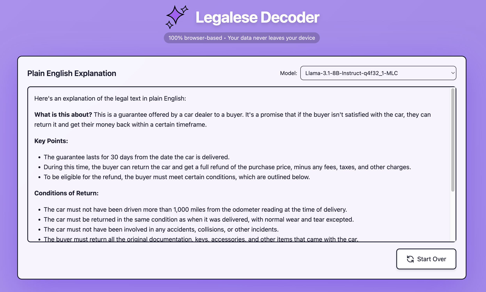

# Legalese Decoder

[](https://opensource.org/licenses/MIT)
[](https://github.com/mlc-ai/web-llm)
[](https://reactjs.org/)
[](https://tailwindcss.com/)

## [🚀 Try it now!](https://thomas-mckanna.github.io/legalese-to-plain-english/)



## Overview

Legalese Decoder is a powerful web application that translates complex legal text into plain, easy-to-understand English, running entirely in your browser. No server required! Simply paste your legal document, contract, or terms of service, and watch as it's transformed into clear, accessible language.

## Features

- 📝 **Legal Text to Plain English** - Translate complex legal jargon into everyday language
- 💻 **100% Client-side** - All processing happens in your browser
- 🔒 **Privacy-focused** - No data leaves your device
- 🌐 **Works offline** - Once loaded, no internet connection needed
- ⚡ **Markdown rendering** - Results are formatted for better readability
- 🎛️ **Customizable models** - Choose from different LLM models based on your needs

## How It Works

Legalese Decoder uses WebLLM to run large language models directly in your browser:

1. **Paste your legal text** - Input the legal document you want to decode
2. **Local processing** - Your text is processed entirely on your device
3. **Plain English output** - Receive a clear, easy-to-understand translation

## Getting Started

1. Visit the [Legalese Decoder app](https://thomas-mckanna.github.io/legalese-to-plain-english/)
2. Wait for the model to load (this may take a moment depending on your connection)
3. Paste your legal text into the input box
4. Click "Decode Legalese" and receive your plain English translation
5. Use the "Start Over" button to translate another document

## Example Use Cases

- Decoding terms of service agreements
- Understanding legal contracts before signing
- Simplifying complex legal documents for clients
- Making legal information more accessible to non-lawyers
- Helping students understand legal case studies

## Future Improvements

- **Multi-language support** - Translate legal text from and to multiple languages
- **Image OCR integration** - Extract text directly from images or PDFs of legal documents
- **OpenAI API integration** - Option to use OpenAI's models via API key for enhanced performance
- **Document summarization** - Provide concise summaries of lengthy legal documents
- **Legal term highlighting** - Identify and explain specific legal terms within documents
- **Export and sharing options** - Save and share your decoded text in various formats

## Local Development

```bash
# Clone the repository
git clone https://github.com/Thomas-McKanna/legalese-to-plain-english.git

# Navigate to the project directory
cd legalese-to-plain-english

# Install dependencies
npm install

# Start the development server
npm run dev
```

## Contributing

Contributions are welcome! Please feel free to submit a Pull Request.

## Acknowledgements

This project wouldn't be possible without these amazing open-source projects:

- [WebLLM](https://github.com/mlc-ai/web-llm) - For running LLMs directly in the browser
- [React](https://reactjs.org/) - For building the user interface
- [TailwindCSS](https://tailwindcss.com/) - For styling the application
- [React Markdown](https://github.com/remarkjs/react-markdown) - For rendering markdown content

## License

This project is licensed under the MIT License - see the LICENSE file for details.
